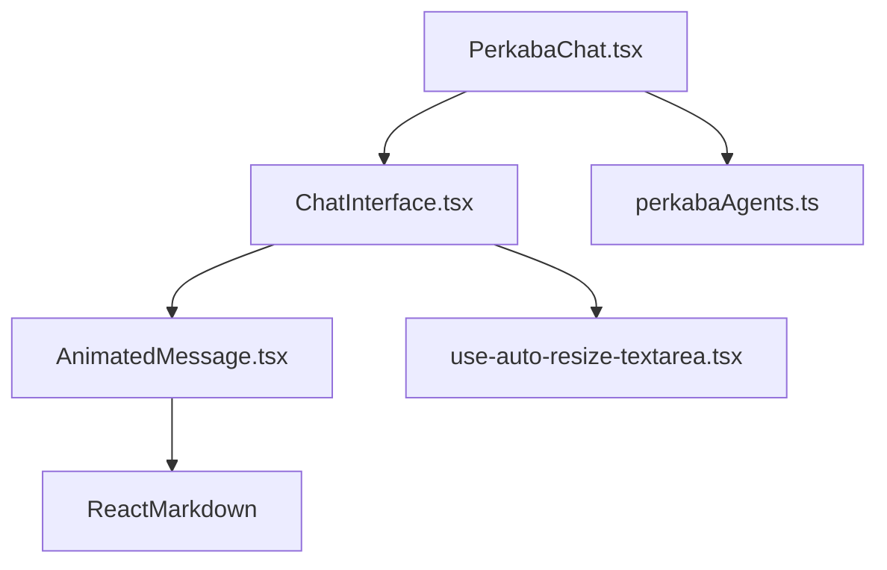

# POLICE INVESTIGATOR PHIDATA WORKFLOW

## Project Structure

```
├── src/
│   ├── components/
│   │   ├── agent-forms/                # Folder for agent-specific forms
│   │   │   ├── BaseAgentForm.tsx      # Base form component for agents
│   │   │   └── ImageAgentForm.tsx     # Specialized form for image analysis
│   │   ├── ui/                        # UI components
│   │   │   ├── Modal.tsx              # Reusable modal component
│   │   │   ├── label.tsx              # Label component for form elements
│   │   │   ├── select.tsx             # Select component for dropdowns
│   │   │   ├── ChatInterface.tsx      # Chat interface for Flowise integration
│   │   │   ├── AnimatedMessage.tsx    # Animated text display for chat messages
│   │   │   ├── use-auto-resize-textarea.tsx  # Custom hook for textarea auto-resizing
│   │   ├── AgentCard.tsx              # Card component for displaying agents
│   │   ├── AutosizeTextarea.tsx       # Reusable textarea component
│   │   ├── CaseCard.tsx               # Card component for case display
│   │   ├── ProgressSteps.tsx          # Progress indicator component
│   │   ├── ResultArtifact.tsx         # Component for displaying analysis results
│   │   ├── Sidebar.tsx                # Navigation sidebar component
│   │   ├── ThinkingAnimation.tsx      # Loading animation component
│   │   └── WorkflowCard.tsx           # Card component for workflow display
│   │
│   ├── config/
│   │   └── env.ts                     # Environment configuration
│   │
│   ├── data/
│   │   └── agents/
│   │       ├── index.ts               # Exports all agent configurations
│   │       ├── spktAgent.ts           # SPKT report analysis agent
│   │       ├── caseResearchAgent.ts   # Case research analysis agent
│   │       ├── hoaxCheckerAgent.ts    # Hoax verification agent config
│   │       ├── imageAgent.ts          # Image analysis agent config & prompts
│   │       ├── perkabaAgents.ts       # Perkaba chat agents configuration
│   │       └── undangAgent.ts         # Legal expert agent configuration
│   │
│   ├── hooks/
│   │   └── useAgentForm.ts           # Custom hook for form management
│   │
│   ├── pages/
│   │   ├── Agents.tsx                # Main container for all agents
│   │   ├── Reports.tsx               # Reports management page
│   │   ├── PencarianPutusan.tsx      # Court decisions search page
│   │   ├── PerkabaChat.tsx           # Perkaba chat page
│   │   └── UndangUndang.tsx          # Legal expert consultation page
│   │
│   ├── services/
│   │   ├── imageService.ts           # API & Gemini integration services
│   │   ├── agentSpkt.ts             # SPKT report analysis service
│   │   ├── agentCaseResearch.ts     # Case research analysis service
│   │   ├── agentHoaxChecker.ts      # Hoax verification service
│   │   ├── perkabaService.ts        # Flowise chat integration service
│   │   ├── searchPutusanService.ts   # Court decisions search service
│   │   ├── undangService.ts         # Legal expert chat service
│   │   └── supabase.ts              # Supabase client configuration
│   │
│   ├── types/
│   │   ├── index.ts                  # TypeScript type definitions
│   │   └── react-loading-indicators.d.ts  # React loading indicators type definitions
│   │
│   ├── utils/
│   │   └── utils.ts             # Utility functions for agents
│   │
│   ├── App.tsx                       # Main application component
│   ├── main.tsx                      # Application entry point
│   ├── index.css                     # Global styles
│   └── vite-env.d.ts                # Vite type declarations
```

## Key Features

1. Investigation Agents:
   - SPKT Report Analysis (ID: spkt_001)
     * Analyzes police report narratives
     * Extracts key case elements
     * Structures information by objects, subjects, locus, and tempus
     * Generates organized report summaries

   - Case Research Analysis (ID: case_001)
     * Conducts deep research on case details
     * Identifies relevant legal precedents
     * Analyzes case patterns and similarities
     * Provides investigative recommendations

   - Image Analysis (ID: img_001)
     * Computer vision-based analysis
     * Object and text detection
     * Scene analysis and description
     * Evidence documentation support
     * Multiple analysis modes (default, text extraction)

   - Hoax Checker (ID: hoax_001)
     * Verifies information authenticity
     * Cross-references with trusted sources
     * Identifies potential misinformation
     * Provides verification report

   - Perkaba Chat Integration:
     * Real-time chat interface with Flowise
     * Source document references
     * Error handling and retry mechanisms
     * Streaming response support
     * CORS-enabled proxy configuration
     * Secure API key management

   - Legal Expert (ID: undang_001)
     * Real-time legal consultation
     * Analysis of laws and regulations
     * Interpretation of legal documents
     * Reference to relevant laws
     * Source document citations
     * Legal precedent analysis
     * Regulatory compliance guidance
     * Legal terminology explanations

   Common Features Across Agents:
     * Unique ID system for clear identification
     * Consistent API integration
     * Real-time processing status
     * Structured output format
     * Error handling and validation
     * Stream processing support

2. Court Decisions Search:
   - Semantic Search Integration:
     * OpenAI embeddings for semantic similarity
     * Vector search using Supabase pgvector
     * Relevance scoring and ranking
   - Search Features:
     * Case chronology analysis
     * Similarity-based matching
     * Highlighted text matches
     * Progressive search steps
     * Fallback search with lower threshold
   - Results Display:
     * Case metadata presentation
     * Relevance percentage
     * Direct links to documents
     * Tagged categories
     * Matched text segments with highlights

3. Case Management:
   [Previous case management section remains the same...]

4. UI Components:
   - Previous components plus:
     * Chat interface with typing indicators
     * Source document display
     * Progress Steps indicator
     * Responsive search results cards
     * Animated loading states
     * Mobile-optimized layouts

5. State Management:
   - Previous features plus:
     * Chat message history
     * Search state management
     * Progressive step tracking
     * Error handling for searches
     * Loading states for search operations

6. API Integration:
   - Previous integrations plus:
     * Flowise API integration
     * OpenAI Embeddings API
     * Supabase Vector Store
     * Document similarity search
     * File and metadata retrieval

## Components Overview

1. UI Components:
   - Modal: Reusable modal dialog for displaying detailed information
   - Label: Form label component used in agent forms
   - Select: Dropdown select component used in agent forms
   - ChatInterface: Real-time chat interface with Flowise integration
   - All UI components follow consistent styling and accessibility patterns

2. Agent Forms:
   - BaseAgentForm: Template for all agent-specific forms
   - ImageAgentForm: Specialized form for image analysis
     - Uses Label and Select components for form controls
     - Custom image preview and analysis options

## Perkaba Chat Components

### Core Components

#### ChatInterface.tsx
The main chat interface component that handles:
- Message state management
- Chat history display
- Message submission and response handling
- Auto-scrolling to latest messages
- Loading states
- Error handling
- Source document display

#### AnimatedMessage.tsx
A component that provides animated text display for chat messages:
- Uses ReactMarkdown for message formatting
- Supports GitHub Flavored Markdown
- Custom styling for lists and other markdown elements
- Smooth text animation for bot responses

### Utility Components and Hooks

#### use-auto-resize-textarea.tsx
A custom hook for textarea auto-resizing:
- Dynamically adjusts textarea height based on content
- Supports minimum and maximum height constraints
- Handles window resize events
- Memory efficient with cleanup on unmount

### Data and Configuration

#### perkabaAgents.ts
Defines the available Perkaba agents:
- Chat agent for general queries
- Search agent for document analysis
- Configurable fields for each agent
- Status tracking for agent availability

### Pages

#### PerkabaChat.tsx
The main page component for Perkaba chat functionality:
- Agent selection interface
- Form handling and submission
- State management for selected agents
- Conditional rendering of chat or search interfaces
- Error and loading state management

### Component Relationships


### Key Features
1. **Real-time Chat**
   - Animated message display
   - Markdown support
   - Auto-scrolling
   - Message history

2. **User Experience**
   - Auto-resizing input
   - Loading indicators
   - Error handling
   - Source document display

3. **Agent System**
   - Multiple agent types
   - Configurable fields
   - Status tracking
   - Form validation

4. **Styling**
   - Tailwind CSS integration
   - Custom list styling
   - Responsive design
   - Consistent typography

### Usage Example
```tsx
// In your page component
import ChatInterface from '../components/ChatInterface';

function MyPage() {
  return (
    <div>
      <h1>Perkaba Chat</h1>
      <ChatInterface />
    </div>
  );
}
```

## Implementation Details

1. Agent Services:
   - SPKT Analysis Service (agentSpkt.ts):
     [Previous content remains...]

   - Case Research Service (agentCaseResearch.ts):
     [Previous content remains...]

   - Hoax Checker Service (agentHoaxChecker.ts):
     * Integration with AI model for content analysis
     * Streaming response support for real-time feedback
     * Error handling and validation
     * Components:
       - Content validation endpoint integration
       - Source credibility checking
       - Pattern matching for known hoax indicators
       - Structured response formatting
     * Dependencies:
       - hoaxCheckerAgent.ts: Agent configuration and field definitions
       - useAgentForm.ts: Form state management
       - BaseAgentForm.tsx: UI component for input handling

   - Image Analysis Service (imageService.ts):
     [Previous content remains...]

   - Perkaba Chat Service (perkabaService.ts):
     * Integration with Flowise API
     * Real-time chat functionality
     * Source document handling
     * Components:
       - Chat message handling
       - Error management
       - Response streaming
       - Source document display
     * Dependencies:
       - ChatInterface.tsx: UI component
       - env.ts: Environment configuration
       - vite.config.ts: Proxy configuration

   - Legal Expert Service (undangService.ts):
     * Integration with Flowise API
     * Real-time chat functionality
     * Legal document reference handling
     * Components:
       - Chat message handling
       - Error management
       - Response streaming
       - Source document display
     * Dependencies:
       - ChatInterface.tsx: UI component
       - env.ts: Environment configuration
       - vite.config.ts: Proxy configuration

## Environment Configuration

Required environment variables:
```bash
# Previous environment variables plus:
VITE_SUPABASE_URL=your-supabase-url
VITE_SUPABASE_ANON_KEY=your-supabase-anon-key
VITE_OPENAI_API_KEY=your-openai-key
VITE_PERKABA_API_URL=your-flowise-url
VITE_PERKABA_API_KEY=your-flowise-api-key
```

## Type System

Key TypeScript types:
1. Previous types plus:
2. Document Types:
   - LegalDocument interface
   - DocumentMetadata interface
   - SearchResult interface
3. Search Related:
   - OpenAIError interface
   - SupabaseDocument interface
   - ProgressStepsProps interface
4. Chat Related:
   - ChatResponse interface
   - ChatRequest interface
   - Message interface

## New Components

1. ProgressSteps:
   - Visual step indicator
   - Animated progress tracking
   - Mobile responsive design
   - Status indication (complete, current, pending)

2. Court Decisions Search:
   - Chronology input form
   - Real-time search progress
   - Results card with metadata
   - Document preview and links

3. Search Service:
   - Vector embedding generation
   - Similarity search implementation
   - Results processing and formatting
   - Error handling and fallbacks

4. Chat Interface:
   - Real-time chat interface with Flowise integration
   - Source document display
   - Chat message handling
   - Error management

## Features

1. Court Decisions Search (PencarianPutusan):
   - Natural language search for relevant court decisions
   - Real-time search progress tracking
   - Interactive search results with metadata display
   - Modal view for detailed document inspection
   - Document content copying and downloading
   - Mobile-responsive design

2. Image Analysis:
   [Previous image analysis section remains the same...]

3. Perkaba Chat Integration:
   - Real-time chat interface with Flowise
   - Source document references
   - Error handling and retry mechanisms
   - Streaming response support
   - CORS-enabled proxy configuration
   - Secure API key management

4. Legal Expert Integration:
   - Real-time legal consultation interface
   - Access to comprehensive legal database
   - Document-based responses with citations
   - Legal terminology explanations
   - Regulatory compliance guidance
   - Integration with existing chat system
   - Mobile-responsive design
   - Error handling and fallback mechanisms


PROMPT :

Buat agen baru dengan spesifikasi berikut:

1. Nama Agen: [nama agen]
2. Path Route: /[path-route]
3. Icon: [nama icon dari lucide-react]
4. Deskripsi: [deskripsi singkat agen]
5. ChatflowId: [ID dari Flowise yang akan digunakan]

Buatkan file-file berikut:
1. Service file (src/services/[name]Service.ts)
2. Page file (src/pages/[Name].tsx)
3. Update di Sidebar.tsx
4. Update di App.tsx
5. Update project.md dengan:
   - Tambahkan di Project Structure
   - Tambahkan di Investigation Agents
   - Tambahkan di Implementation Details
   - Tambahkan di Features

Pastikan:
- Tidak menghapus fitur yang sudah ada
- Mengikuti pola yang sama dengan agen-agen sebelumnya
- Menggunakan komponen yang sudah ada (ChatInterface, AgentCard, dll)
- Mempertahankan styling yang konsisten

Buat agen baru dengan spesifikasi berikut:

1. Nama Agen: Ahli Undang-Undang
2. Path Route: /undang-undang
3. Icon: Scale
4. Deskripsi: Ajukan pertanyaan seputar Undang-Undang dan dapatkan jawaban berdasarkan peraturan yang berlaku
5. ChatflowId: CHATFLOW_ID_AKAN_DIISI_NANTI

[Sisanya akan mengikuti template di atas]